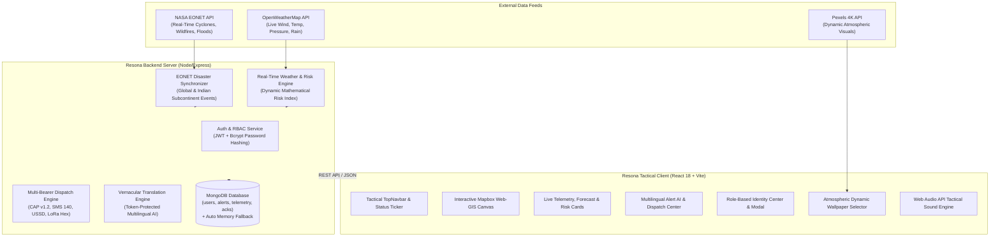

# 🛰️ Resona - Last-Mile Emergency Broadcast & Disaster Intelligence Platform

[](https://reactjs.org/)
[](https://vitejs.dev/)
[](https://tailwindcss.com/)
[](https://nodejs.org/)
[](https://expressjs.com/)
[](https://www.mongodb.com/)
[](https://www.mapbox.com/)
[](https://eonet.gsfc.nasa.gov/)
[](https://opensource.org/licenses/MIT)

> **Resona** is a mission-critical, multi-bearer disaster intelligence and last-mile emergency broadcast platform. It bridges the critical communication gap during catastrophic weather and climate disasters (cyclones, floods, severe storms, heatwaves) by combining real-time NASA & OpenWeather telemetry, AI-powered vernacular translation, and fail-safe dissemination across cellular, SMS, USSD, and off-grid LoRa mesh radio networks.

---

## 📌 The Problem & Resona's Solution

During severe climate emergencies:
1. **Network Blackouts:** Traditional 4G/5G cell towers and internet backbones fail due to high winds, flooding, or power station collapse.
2. **Language Barriers:** Official bureaucratic bulletins from meteorological agencies are issued in complex English or formal Hindi, leaving coastal fishers, rural farmers, and vernacular populations unaware of life-saving instructions.
3. **Information Overload:** First responders need real-time geospatial positioning of active hazards, localized risk scoring, and verified identity authorization to prevent panic and disinformation.

**Resona solves this through:**
- **Automated Vernacular AI:** Translates official alerts into regional Indian languages while strictly locking critical numbers, dates, wind velocities, and emergency helpline numbers with token shields.
- **Multi-Bearer Redundancy:** Dispatches simultaneously to Common Alerting Protocol (CAP XML 1.2), 140-character compressed SMS, offline USSD menus (`*999*...#`), and raw hexadecimal LoRa packets for off-grid radio modems.
- **Live Geospatial Hazard Map:** Combines NASA EONET satellite-tracked disaster events and live OpenWeather physical measurements onto an interactive dark Web-GIS canvas.
- **Identity & Role-Based Crisis Dispatch:** Enforces strict role verification (Disaster Commanders, IMD Meteorologists, Authorized Relief Volunteers, and Citizen SOS reporters) backed by bcrypt authentication and MongoDB persistence.

---

## 🏗️ System Architecture



---

## ⚡ Core Platform Capabilities

### 1. 🗺️ Geospatial Disaster Command Center (Mapbox Web-GIS)
- Real-time plotting of active global and national disaster coordinates fetched from **NASA EONET v3**.
- Color-coded severity pins:
  - 🔴 **Severe / Critical Hazards** (Super Cyclones, Active Wildfires, Flash Floods)
  - 🟡 **Moderate / Caution Zones** (Thunderstorms, Heavy Rains)
  - 🔵 **Stationary Weather Hubs** (Puri, Paradip, Kolkata, Chennai, Mumbai, Bhubaneswar)
- Interactive popup overlays providing categorized emergency instructions, coordinates, and real-time wind/temperature telemetry.

### 2. 🌐 Multilingual Alert AI with Token Protection
- Converts bureaucratic advisories into clean, actionable vernacular alerts in **Odia, Hindi, Bengali, Tamil, Telugu, Marathi, Gujarati, Kannada, Malayalam, and Urdu**.
- **Critical Token Guardian:** Regex-shields critical tokens (e.g. `120 km/h`, `29 Sep`, `1077`, `6.5m waves`) with numbered placeholders (`__PROTECT0__`) so translation engines never corrupt numbers, deadlines, or helpline figures.
- Dual-mode AI:
  - **Lightweight Built-In Engine:** Instant dictionary/template translation running offline without GPU/internet requirements.
  - **Neural MT Service:** Compatible with Hugging Face `ai4bharat/indictrans2-en-indic-1B` for real-time deep neural translation.

### 3. 📡 Multi-Bearer Resilient Broadcast Engine
With a single broadcast trigger, Resona generates:
- **OASIS CAP v1.2 XML:** Fully compliant XML for emergency sirens, TV ticker systems, and government alerting hubs.
- **Compressed SMS 140:** Compact plain-text summaries engineered to fit within a single 140-character GSM SMS packet.
- **Offline USSD Protocol Strings:** Rapid dial codes (`*999*01*...#`) accessible on 2G feature phones without an active data plan.
- **LoRa Mesh Hexadecimal Payloads:** Ultra-compact hexadecimal byte strings formatted for long-range, low-power 868MHz / 433MHz emergency radio repeaters.

### 4. 🧮 Mathematical Real-Time Risk Index
- Computes risk levels (`SAFE`, `CAUTION`, `SEVERE`, `CATASTROPHIC`) dynamically from live atmospheric observations:
  $$\text{Risk Score} = \text{base} + (\text{Wind} \times 0.45) + (\text{Precipitation} \times 0.35) + (\text{Pressure Deficit} \times 0.20)$$
- Real-time gauge visualization with dynamic color shifting and animated status indicators.

### 5. 🛡️ Identity & Crisis Role Authorization (RBAC)
- Full authentication system with JWT sessions and bcrypt password hashing.
- Four distinct operational roles:
  1. **Disaster Management Officer / Commander:** Full administrative command, state-wide broadcasts, emergency drill controls.
  2. **Meteorological Specialist (IMD):** Scientific weather verification, radar telemetry validation, sensor calibration.
  3. **Disaster Relief Volunteer:** Verified on-ground field responders authorized to broadcast local neighborhood alerts.
  4. **Citizen / Resident:** Access to vernacular advisories, personal safety check-in, and one-touch SOS dispatch.

### 6. 🎨 Atmospheric Dynamic Wallpaper Engine
- Seamlessly integrates with the **Pexels API** to stream curated 4K dynamic wallpapers of cyclones, thunderstorms, supercells, and tempest skies.
- Local offline fallbacks including orbital satellite cyclone imagery.
- Live wallpaper gallery modal with manual pickers and an auto-refresh timer toggle.

### 7. 🔊 Cyber-Tactical Audio Engine
- Built directly on the native **Web Audio API** with zero external audio assets.
- Produces tactical interface blips, critical alert sirens, broadcast success chimes, and verification dings with custom oscillator wave shaping.

---

## 📂 Repository Structure

```
IGNITHON-WEATHER/
├── Resona/
│   ├── BACKEND/                        # Express API & Disaster Telemetry Engine
│   │   ├── models/                     # Mongoose schemas (User, Alert, Telemetry, etc.)
│   │   ├── routes/                     # Express routes (authRoutes, alertRoutes, weatherRoutes)
│   │   ├── services/                   # Business logic (eonetService, capGenerator, translatorService)
│   │   ├── data/                       # Pre-configured disaster scenarios & presets
│   │   ├── server.js                   # Main API entry point
│   │   ├── .env.example                # Backend environment template (safe)
│   │   └── package.json
│   │
│   ├── FRONTEND/                       # React 18 + Vite Tactical Web-GIS Client
│   │   ├── public/                     # Satellite backgrounds & static assets
│   │   ├── src/
│   │   │   ├── components/             # UI Components (IndiaDisasterMap, TopNavbar, AuthPage, etc.)
│   │   │   ├── context/                # React context (AuthContext, WeatherContext)
│   │   │   ├── services/               # Client-side services (pexelsService)
│   │   │   ├── utils/                  # Tactical audio synthesizer & helper scripts
│   │   │   ├── App.jsx                 # Master application controller & navigation
│   │   │   ├── index.css               # Tailwind design system & tactical keyframe animations
│   │   │   └── main.jsx
│   │   ├── .env.example                # Frontend environment template (safe)
│   │   ├── vite.config.js
│   │   └── package.json
│   │
│   ├── multilingual-alert-ai/          # Python/FastAPI Neural Translation Microservice
│   │   ├── app/                        # FastAPI application, token shields & model loaders
│   │   ├── tests/                      # Unit tests for translation & token preservation
│   │   ├── Dockerfile
│   │   └── requirements.txt
│   │
│   ├── .gitignore                      # Security-hardened git ignore rules
│   └── README.md                       # Comprehensive documentation
│
└── .gitignore                          # Root safety gitignore
```

---

## 🔌 API Endpoints Reference

### 1. Authentication & Identity (`/api/auth`)
| Method | Endpoint | Description |
|---|---|---|
| `POST` | `/api/auth/register` | Register a new user with specific role and location |
| `POST` | `/api/auth/login` | Authenticate credentials; returns JWT session token |
| `GET` | `/api/auth/me` | Retrieve currently authenticated user profile |
| `GET` | `/api/auth/users` | List registered personnel and community members |
| `POST` | `/api/auth/seed-demo` | Seed default operational accounts if database is fresh |

### 2. Alerts & Emergency Broadcast (`/api`)
| Method | Endpoint | Description |
|---|---|---|
| `GET` | `/api/health` | Healthcheck and MongoDB connection status |
| `GET` | `/api/presets` | Pre-calibrated emergency scenarios (Cyclone, Heatwave, Tsunami) |
| `POST` | `/api/broadcast` | Dispatch emergency alert across CAP, SMS, USSD & LoRa |
| `GET` | `/api/telemetry` | Retrieve broadcast transmission delivery metrics |
| `GET` | `/api/nasa-eonet` | Real-time active disaster coordinates from NASA EONET |
| `POST` | `/api/verify-alert`| Validate incoming text and protect critical tokens |

### 3. Weather & Live Sensors (`/api/weather`)
| Method | Endpoint | Description |
|---|---|---|
| `GET` | `/api/weather/current?city=Puri` | Live ambient weather observation for a target city |
| `GET` | `/api/weather/batch` | Synchronized weather readings for major Indian risk hubs |
| `GET` | `/api/weather/forecast?city=Puri`| 5-day atmospheric forecast breakdown |
| `GET` | `/api/weather/hazard-alerts` | Dynamic weather hazard alerts generated from physical sensors |

---

## 👥 Default Demo Personnel Accounts

Use these pre-configured accounts to test role-based permissions:

| Role | Name | Email | Password | Badge ID | Permissions |
|---|---|---|---|---|---|
| **Disaster Commander** | Commander Arjun Patel | `commander@resona.gov.in` | `Password123!` | `CMD-1011` | State-wide broadcasts, emergency drills, all controls |
| **Meteorological Specialist** | Priya Sharma | `priya.imd@gov.in` | `Password123!` | `IMD-2045` | Weather sensor calibration, risk index analysis |
| **Disaster Relief Volunteer** | Ramesh Das | `volunteer@resona.org` | `Password123!` | `VOL-4022` | Localized vernacular broadcast dispatch |
| **Citizen / Resident** | Sunita Nayak | `citizen@resona.org` | `Password123!` | `CIT-8821` | Safety check-in, SOS alerts, vernacular feed |

---

## 🚀 Getting Started

### Prerequisites
- **Node.js** (v18.0 or newer)
- **npm** (v9.0 or newer)
- **MongoDB** (Local instance on `mongodb://localhost:27017` or MongoDB Atlas URI; *Note: Backend includes automatic in-memory fallback if MongoDB is not running*).

---

### Step 1: Environment Setup

#### Backend Configuration
Copy the template in `Resona/BACKEND`:
```bash
cd Resona/BACKEND
cp .env.example .env
```
Edit `BACKEND/.env` with your values:
```env
PORT=5000
MONGODB_URI=mongodb://localhost:27017/resona_db
JWT_SECRET=your_super_secret_jwt_key
OPENWEATHER_API_KEY=your_openweather_api_key_here
```

#### Frontend Configuration
Copy the template in `Resona/FRONTEND`:
```bash
cd ../FRONTEND
cp .env.example .env
```
Edit `FRONTEND/.env` with your public keys:
```env
VITE_MAPBOX_TOKEN=your_mapbox_public_token_here
VITE_PEXELS_API=your_pexels_api_key_here
```
*(If no API keys are supplied, the application automatically falls back to curated high-resolution storm wallpapers and graceful default telemetry).*

---

### Step 2: Install Dependencies & Run

#### Terminal 1 — Start Backend Server
```bash
cd Resona/BACKEND
npm install
npm start
```
The backend initializes on **`http://localhost:5000`** with automatic database seeding and healthcheck logging.

#### Terminal 2 — Start Frontend Client
```bash
cd Resona/FRONTEND
npm install
npm run dev
```
The interactive tactical command center will open on **`http://localhost:5173`**.

---

## 🔒 Security & Privacy

- **Protected Secrets:** No production secrets or personal API keys are tracked in version control. All credentials must be placed inside local `.env` files that are strictly excluded by `.gitignore`.
- **Password Security:** All user credentials stored in MongoDB are salted and hashed using **bcrypt** with a cost factor of 10.
- **Fail-Safe Graceful Degradation:** External API failures (NASA, OpenWeather, or Pexels) never break application availability; built-in local cache pools and fallback presets seamlessly engage.

---

## 📄 License
This project is licensed under the **MIT License**. See the `LICENSE` file for details.
